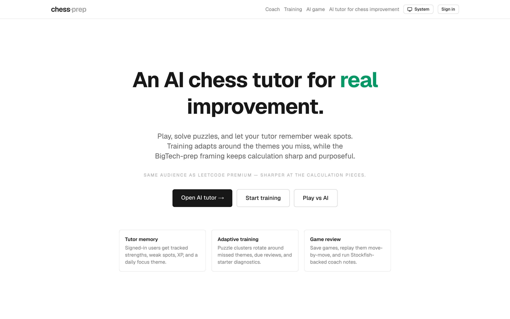
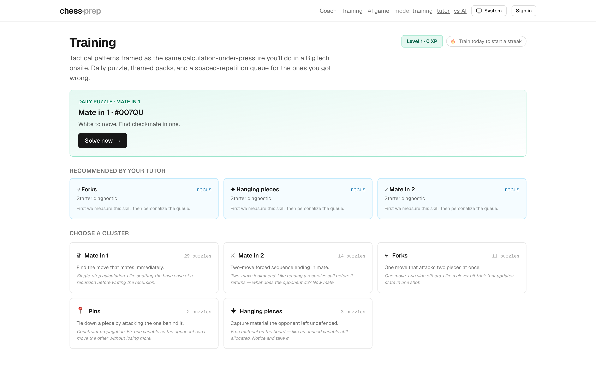
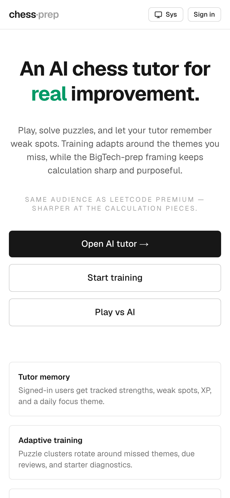

# chess·prep — Personal AI chess tutor

> An AI chess tutor that remembers your puzzle results, finds weak spots, and turns them into focused training missions. Built for the engineer-prepping-BigTech crowd.

[](https://chess-bigtech-prep.vercel.app)
[](https://github.com/almacho04/chess-bigtech-prep)
[](https://nextjs.org/)
[](https://www.typescriptlang.org/)
[](https://supabase.com/)
[](https://stockfishchess.org/)
[](https://ai.google.dev/)



---

## Three reasons it's not just another chess site

### 1 · AI Coach that explains *why* you blundered, not just *that* you did

Stockfish flags every move that lost material, draws a **red arrow on the move you played** and a **green arrow on the move it would have played**, and (with a Gemini API key) writes a 2–3 sentence explanation that frames the mistake in interview-prep idiom.

*"Nxd5 drops a knight for a pawn after …exd5. You missed a basic material count. This is like not checking constraints and immediately assuming you can use an O(N²) solution for N=10⁵."*


### 2 · Personal tutor that remembers you

`/coach` is a dashboard, not a leaderboard. It tracks per-theme accuracy from puzzles **separately** from per-theme mistake counts from your real games, ranks your weakest themes, picks today's mission, and keeps an XP/level loop running. Sign in once and it remembers you across devices.


### 3 · Themed cluster training with spaced repetition

`/training` ships a **59-puzzle bank** from the Lichess CC0 database, hand-curated into 5 clusters (Mate-in-1, Mate-in-2, Forks, Pins, Hanging pieces). Each cluster carries an interview-prep analogy. Wrong attempts come back on a 1 → 3 → 7 → 14 → 30 day schedule — same loop Anki uses.




---

## Try it in 30 seconds

1. Open **https://chess-bigtech-prep.vercel.app**
2. Click **"Start training"** and solve one puzzle — drag a piece, or click-then-click.
3. Sign in with a magic-link email, then open **"Open AI tutor →"** to see weak/strong spots build up.
4. Finish a quick **"Play vs AI"** at *Easy*, save it, open it from **History**, click **Analyze this game** — watch the red/green arrows appear.

## Routes at a glance

| Route | What it does |
|---|---|
| `/` | Landing — pitch + three CTAs |
| `/training` | Daily puzzle, due-today queue, 5 cluster cards, multi-move solver |
| `/coach` | Personal tutor dashboard (signed in) |
| `/play/ai` | Stockfish opponent, 4 difficulty levels, runs in-browser |
| `/play/local` | Pass-and-play 2-player |
| `/history` | Saved games + replay viewer |
| `/history/[id]` | Per-game replay with AI Coach panel |
| `/api/coach/explain` | Gemini-backed explanation proxy (server) |

## Mobile



---

## Tech stack

| Layer | Choice | Why |
|---|---|---|
| Framework | **Next.js 16** (App Router, Turbopack) + **TypeScript** strict | SSR + edge deploys + first-class Server Components |
| Styling | **Tailwind CSS v4** + `data-theme`-driven dark variant | Fast iteration; theme toggle beats system preference |
| Chess rules | **`chess.js` v1** | Battle-tested move generation; pure helpers in [`lib/chess/game.ts`](chess-app/src/lib/chess/game.ts) |
| Board UI | **`react-chessboard` v5** | Drag + click + arrow overlays |
| Engine | **Stockfish 10** (WASM, vendored) | Runs entirely client-side; zero server compute |
| LLM coach | **Google Gemini 2.5 Flash** | Free tier, no credit card, 250 RPD |
| Auth + DB | **Supabase** — Postgres + Auth + RLS, via `@supabase/ssr` | RLS gates everything; the anon key in the browser is harmless |
| Hosting | **Vercel** | Hobby plan, zero-config Next.js |
| Persistence | `localStorage` (in-progress) + Postgres (completed) | Survives reload offline; persists across devices online |

## Architecture at a glance

```
chess-app/
├── public/engines/          ← Stockfish WASM (vendored)
├── src/
│   ├── app/                 ← App-Router routes
│   │   ├── page.tsx                 (landing)
│   │   ├── coach/page.tsx           (personal tutor profile)
│   │   ├── training/page.tsx        (cluster picker + solver)
│   │   ├── play/{local,ai}/page.tsx
│   │   ├── history/page.tsx + [gameId]/page.tsx
│   │   ├── api/coach/explain/       (Gemini REST proxy)
│   │   └── auth/callback/route.ts
│   ├── components/
│   │   ├── chess/           (board, game shells, promotion picker, replay, coach panel)
│   │   ├── training/        (puzzle solver, training shell, streak badge)
│   │   └── site/            (header, theme toggle, auth button, unauth panel)
│   ├── lib/
│   │   ├── chess/           (pure rules + engine wrapper + difficulty)
│   │   ├── coach/           (Stockfish-driven blunder detection)
│   │   ├── supabase/        (browser + server clients, games, puzzle-attempts, theme-stats, game-analysis)
│   │   ├── theme/           (FOUC-prevention boot script + helpers)
│   │   ├── storage/         (localStorage persistence)
│   │   └── training/        (puzzles, clusters, SM-2, streak math)
│   └── middleware.ts        (Supabase session refresh)
└── supabase/                (schema.sql + 6 numbered migrations)
```

**Data flow when you click "Analyze this game":**
```
React (CoachPanel)
   └─▶ Browser Stockfish (Web Worker)  ──▶  blunders[] with FENs + UCI
        ↓
   POST /api/coach/explain (Edge)  ──▶  Gemini 2.5 Flash (REST)
        ↓
   Supabase RPC (record_theme_signal)  ──▶  user_theme_stats / game_analyses
```

Boundaries we keep clean:
- Chess rules live in **pure functions** with no React imports — unit-testable without a DOM.
- Each interactive surface (`GameShell`, `AiGameShell`, `PuzzleSolver`, `CoachPanel`) is a **single client boundary**; presentational children render on the server when possible.
- Stockfish lives in a **Web Worker** with a tiny promise-based UCI wrapper.
- Supabase is gated by **Row-Level Security** — every policy is `auth.uid() = user_id`. The anon key shipped to the browser can't escape its row scope.

---

## Feature checklist

- [x] Full chess rules — castling, en passant, promotion (with piece-picker modal), check / mate / stalemate / draw detection
- [x] **Stockfish AI opponent** at 4 difficulties, runs in a Web Worker (no server cost, no API key)
- [x] **`/training`** — 59-puzzle Lichess-CC0 bank curated into 5 clusters, multi-move solver, daily puzzle, streak badge, due-today queue
- [x] **Personal tutor profile** at `/coach` — puzzle accuracy + real-game memory + XP + level + daily mission
- [x] **AI Coach** on saved games — red/green arrows, severity colour, magnitude descriptor (`≈ a pawn` / `≈ a minor piece`), Gemini explanations behind a server-side key
- [x] **Magic-link auth** via Supabase + friendly inline sign-in panels on protected routes
- [x] **Persistent game history** — auto-save with PGN + result + move count, deduped, RLS-scoped
- [x] **Move-by-move replay** — step buttons, keyboard nav (←/→/Home/End), click-to-jump on the move list
- [x] **Dark / light theme** with a no-FOUC boot script
- [x] **Mobile-first responsive** — playable in portrait on a 360 px phone
- [x] **localStorage persistence** on every play surface — close the tab, come back, resume
- [ ] Multiplayer via shareable link *(roadmap)*
- [ ] Stripe Pro tier for unlimited AI Coach + advanced packs *(roadmap)*
- [ ] City-based leaderboards *(roadmap)*

---

## Run it locally

```bash
git clone https://github.com/almacho04/chess-bigtech-prep.git
cd chess-bigtech-prep/chess-app
npm install

# Create chess-app/.env.local:
#   NEXT_PUBLIC_SUPABASE_URL=https://<your-project>.supabase.co
#   NEXT_PUBLIC_SUPABASE_ANON_KEY=eyJhbGciOi...
#   GEMINI_API_KEY=AIza...   # optional, enables AI Coach explanations
#
# Then in the Supabase SQL Editor, run these in order:
#   chess-app/supabase/schema.sql
#   chess-app/supabase/migrations/0002_puzzle_attempts.sql
#   chess-app/supabase/migrations/0003_user_theme_stats.sql
#   chess-app/supabase/migrations/0004_game_analyses.sql
#   chess-app/supabase/migrations/0005_game_dedupe.sql
#   chess-app/supabase/migrations/0006_theme_signal_sources.sql

npm run dev          # → http://localhost:3000
npm run build        # production build
npm run lint         # ESLint
npm test             # focused helper tests
```

`/play/local`, `/play/ai`, and `/training` work without a Supabase project — moves persist in `localStorage`. Auth, history, tutor profile, and AI Coach persistence require Supabase.

### Regenerate the screenshots in this README

```bash
# After (one-off) installing the browser:
npx playwright install chromium

# With the app running locally on :3000:
node chess-app/scripts/capture.mjs
```

The script captures the unauthenticated screenshots (landing + training + play/ai, at desktop + mobile widths) into [`docs/media/`](docs/media). Authenticated screenshots (`/coach`, `/history`, `/history/[id]` with arrows) are captured manually since they need a real signed-in session.

---

## The niche story

Most chess sites compete on volume: millions of players, a giant rating ladder, a thousand puzzles. That market is saturated and the leaders (chess.com, lichess) win on network effects.

A wedge in: a **vertical audience with money and a non-chess primary need**.

> **CS students and new grads prepping FAANG interviews.**
> Same audience as LeetCode Premium. Same skill (calculation under time pressure). Adjacent surface (chess) is *under-served* by an interview-prep angle.

The product loop:
1. **Daily puzzle** → habit (LeetCode "daily question" pattern).
2. **Themed clusters** framed as interview-style tactics — forks, pins, calculation under constraints.
3. **AI Coach** turns every real game into a personalised lesson.
4. **Pro tier** ($5–7/mo, matches LeetCode Premium price point): unlimited Coach analyses, advanced packs, custom skins.

Low CAC channel: university CS clubs, BigTech-prep Discords, LeetCode Reddit. The "chess for interview prep" framing is a Trojan horse to bring people into chess from an adjacent market they're already paying for.

---

## What I'd build next

- **Multiplayer-by-link** (Supabase Realtime channel per game ID, no matchmaking).
- **Sharper game→profile classification** — replace the current heuristic blunder tags with real engine-driven theme detection.
- **Spaced-repetition for missed game moves** — every blunder you make in a real game becomes a puzzle queued for tomorrow.
- **Stripe** Pro tier on the AI Coach + advanced packs.
- **More puzzle clusters** — discovered attacks, skewers, endgame patterns, calculation drills under time pressure.

---

## Acknowledgments

- Built for the **nFactorial Incubator** Chess assignment ([brief](material/Chess.pdf)).
- Puzzle bank derived from the [Lichess open puzzle database](https://database.lichess.org/) — CC0.
- **Stockfish 10** © T. Romstad, M. Costalba, J. Kiiski, G. Linscott, et al. (GPL-3).
- **Gemini 2.5 Flash** via Google AI Studio — free tier, no credit card.
- Built with [Claude Code](https://claude.com/claude-code) as a pair-programming partner.
